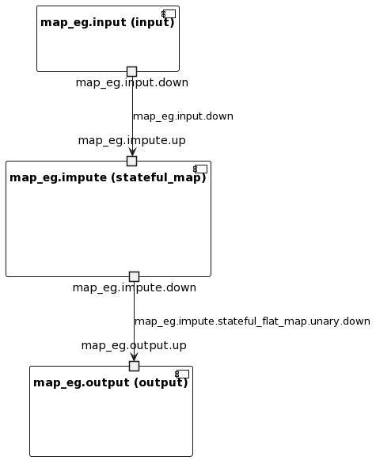

# Imputing Values for real-time ML

- Skill level
    
    **Beginner**
    
- Time to complete
    
    **Approx. 5 min**
    

Introduction: **Given that the real world is never ideal, our datasets are often far from perfect and contain missing values. In order to build accurate machine learning models, we must address missing values. When data is missing, our understanding of the system is incomplete, potentially due to issues such as sensor failure, network issues, or optional data fields. In real-time applications like self-driving cars, heating systems, and smart devices, incorrect interpretation of missing data can have severe consequences. The process for dealing with missing value is called imputation and we will demonstrate how you can build a custom window to deal with this in Bytewax.**

## ****Prerequisites****

**Python modules**
* bytewax==0.19
* numpy

## Your Takeaway

*Learn how to create a sliding window to impute values using numpy*

## Resources

[Github link](https://github.com/bytewax/imputing-missing-values)

### Important Concepts

Bytewax is based around the concept of a **dataflow**. A dataflow is made up of a sequence of operators that interact with data that is “flowing” through it. The dataflow is a directed graph where the nodes are operators and the edges are the data that flows between them. The dataflow is a powerful abstraction that allows you to build complex data processing pipelines with ease.

**Stateless vs stateful** - In Bytewax, operators can be either stateless or stateful. A stateless operator is one that does not maintain any state between invocations. A stateful operator, on the other hand, maintains some state between invocations. This state can be used to store information about the data that has been seen so far, or to store the results of some computation.

**Workers** - A worker is a process that runs a dataflow. Workers are responsible for executing the operators in the dataflow and passing data between them. Workers can run on a single machine, or they can be distributed across multiple machines.

### Goal: generate a dataflow that will impute missing values in a stream of data of random integers and `nan` values.

We can represent our dataflow - called 'map_eg' through this diagram, in which the data flows through three key steps:

1. input
2. stateful map
3. output



During data input, we will generate random integers and `nan` values. In the stateful map, we will create a custom window to impute the missing values. Finally, we will output the data and the imputed value to standard output.

Let's get started!

### Input Code

For this example we will mock up some data that will yield either a random integer between 0 and 10, or a numpy `nan` value for every 5th value we generate.

To simulate the generation of random numbers and `nan` values, we will create a class called `RandomNumpyData` that will return a random integer between 0 and 10 or `nan` value for every 5th value. We will build this class such that it inherits from the `StatelessSourcePartition`. This will enable us to create our input as a Bytewax input partition that is stateless. 

Lastly, we'll need to create a subclass of `DynamicInput` to return our `RandomNumpyData` class.

https://github.com/bytewax/imputing-missing-values/blob/310f3c04a7d2f23825291fcd5740a9692c6f787e/dataflow.py#L14-L33


### Custom Window Using Stateful Map

Before we dive into the code, it is important to understand the stateful map operator. Stateful map is a one-to-one transformation of values in (key, value) pairs, but allows you to reference a persistent state for each key when doing the transformation. The stateful map operator has two parts to it: a `builder` function and a `mapper` function. The `builder` function will get evoked for each new key and the `mapper` will get called for every new data point. For more information on how this works, [the api docs](https://bytewax.io/apidocs/bytewax.dataflow#bytewax.dataflow.Dataflow.stateful_map) have a great explanation.

In our case our key will be the same for the entire stream because we only have one stream of data in this example. So, we have some code that will create a `WindowedArray` object in the builder function and then use the update function to impute the mean.

https://github.com/bytewax/imputing-missing-values/blob/310f3c04a7d2f23825291fcd5740a9692c6f787e/dataflow.py#L41-L63

Let’s unpack the code. When our class `WindowedArray` is initialized, it will create an empty Numpy array with dtype of object.The reason the the object datatype is that this will allow us to add both integers and Nan values. For each new data point that we receive, we will instruct the stateful map operator to use the impute_value method that will check if the value is nan and then calculate the mean from the last `n` objects, `n` being the size of array of values we've "remembered". In other words, how many of the values we care about and want to use in our calculation. this will vary on the application itself. It will also add the value to our window (last_n).

### Output Code

Next up we will use the capture operator to write our code to an output source, in this case `StdOutput`. This is not going to do anything sophisticated, just output the data and the imputed value to standard output.

https://github.com/bytewax/imputing-missing-values/blob/310f3c04a7d2f23825291fcd5740a9692c6f787e/dataflow.py#L70

### Running our dataflow

That’s it! To run the code, use the following invocation:

```bash
> python -m bytewax.run dataflow:flow
```

## Summary

In this example, we learned how to impute missing values from a datastream using Bytewax.

## We want to hear from you!

If you have any trouble with the process or have ideas about how to improve this document, come talk to us in the #troubleshooting Slack channel!

[Share your tutorial progress!](https://twitter.com/intent/tweet?text=I%27m%20mastering%20data%20streaming%20with%20%40bytewax!%20&url=https://bytewax.io/tutorials/&hashtags=Bytewax,Tutorials)
